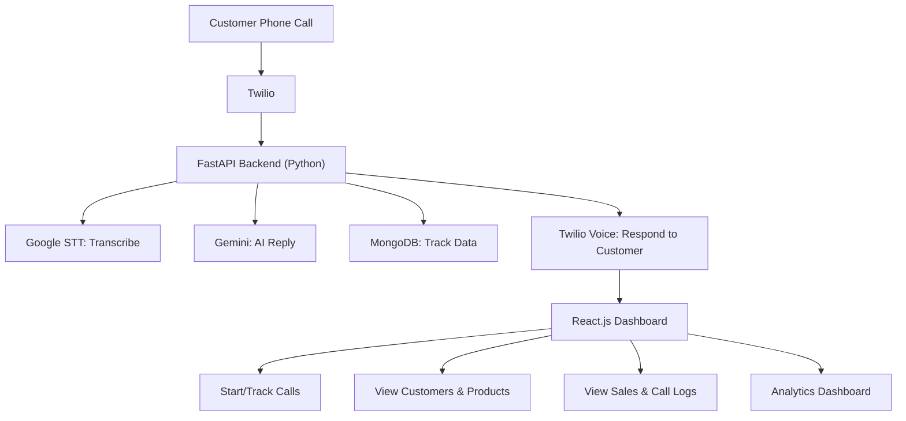

#  AI Voice Sales Agent

> A full-stack platform that automates telephonic product promotions through real-time human-like conversations.


## Overview

The AI Voice Sales Agent revolutionizes traditional cold calling with AI-powered automation. Through our React dashboard, administrators can manage customers and products, and access real-time analytics—all while our AI handles the conversations.

*Key Components:*
- *Voice Calls*: Twilio enables natural phone conversations with customers
- *Speech Recognition*: Google STT accurately transcribes customer responses
- *Conversation AI*: Google Gemini powers intelligent, contextual dialogue
- *Data Management*: MongoDB tracks inventory, customers, sales, and call metrics

## Features

### 1. Human-like Sales Conversations
- *Natural Dialogue*: AI-powered agent calls customers directly using advanced LLM technology
- *Dynamic Promotion*: Intelligently presents products based on customer interests and preferences
- *Smart Conversation Flow*: Auto-detects interest levels and gracefully ends calls when needed

### 2. Inventory & Customer Management
- *Comprehensive Dashboard*: Add, update, and delete customers/products through the UI
- *Interest Mapping*: Link customers to multiple products for targeted promotions

### 3. Sales Logging & Analytics
- *Detailed Call Records*: Each interaction captures product, price, and timestamp
- *Sentiment Analysis*: AI evaluates customer response as positive, neutral, or negative
- *Call Summaries*: Automatic generation of conversation highlights and outcomes

### 4. Live Analytics Dashboard
- *Revenue Tracking*: Monitor sales and call metrics over time with interactive charts
- *Product Performance*: Identify top-selling and highest-revenue generating products
- *Campaign Metrics*: Track success rates, acceptance rates, and conversion metrics

## Installation & Setup
- fastapi
- uvicorn
- twilio
- pymongo
- python-dotenv
- google-cloud-speech
- google-generativeai
- requests

### Prerequisites
- Node.js & npm
- Python 3.8+
- MongoDB
- Twilio, Google, and Gemini API keys


### Clone the repository
``` bash
git clone https://github.com/yourusername/ai-voice-sales-agent.git
cd ai-voice-sales-agent/backend
```

### Install dependencies
``` bash
pip install -r requirements.txt
```
### Create .env file
``` bash
echo "TWILIO_ACCOUNT_SID=your_sid
TWILIO_AUTH_TOKEN=your_token
TWILIO_PHONE_NUMBER=your_number
GEMINI_API_KEY=your_gemini_key
GOOGLE_APPLICATION_CREDENTIALS=your_google_credentials" > .env
```
### Start the server
``` bash
uvicorn main:app --reload
```
### Frontend
``` bash
cd ../Frontend
cd inventory_management_system
npm start
```
### Backend
``` bash
cd Backend
npm run server
 ```

## System Architecture (Flowchart View)


## Tech Stack

### Frontend
- *React.js*: UI component library
- *Bootstrap*: Responsive design framework
- *Chart.js*: Interactive analytics visualizations

### Backend
- *FastAPI*: High-performance Python API framework
- *Express.js*: Node.js middleware for trigger events
- *MongoDB*: NoSQL database for data storage
- *Mongoose*: MongoDB object modeling

### AI/ML
- *Google Gemini 1.5 Flash*: Natural language processing
- *Google STT*: Speech-to-text transcription
- *Twilio*: Programmable voice API

## User Flow

1. *Initialization*: Admin selects the number of customers for cold calling
2. *Call Generation*: System initiates calls to selected customers
3. *Conversation*: 
   - AI introduces itself and determines customer interest
   - Promotes relevant products based on interest signals
   - Handles objections and answers product questions
4. *Outcome Processing*:
   - If sale occurs: Records details in database
   - If rejected: Logs response for future optimization
5. *Analytics*: Dashboard updates with real-time metrics and call results

## Known Issues & Limitations

- Some phone carriers may block automated calls
- Google STT occasionally misinterprets responses in noisy environments
- Gemini response length needs fine-tuning for optimal conversation flow
- API rate limits may affect performance during high-volume campaigns
- UI responsiveness issues on certain older mobile devices

## Roadmap

### Future Development
- WhatsApp & SMS integration for multi-channel communication
- Multilingual support
- Enhanced call analytics with AI-powered insights
- Agent feedback and coaching for sales effectiveness
- Cloud storage with user authentication
- A/B testing for conversation script optimization
- Voice customization and persona selection

